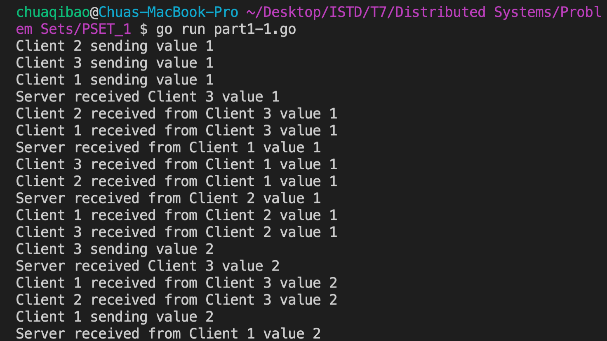
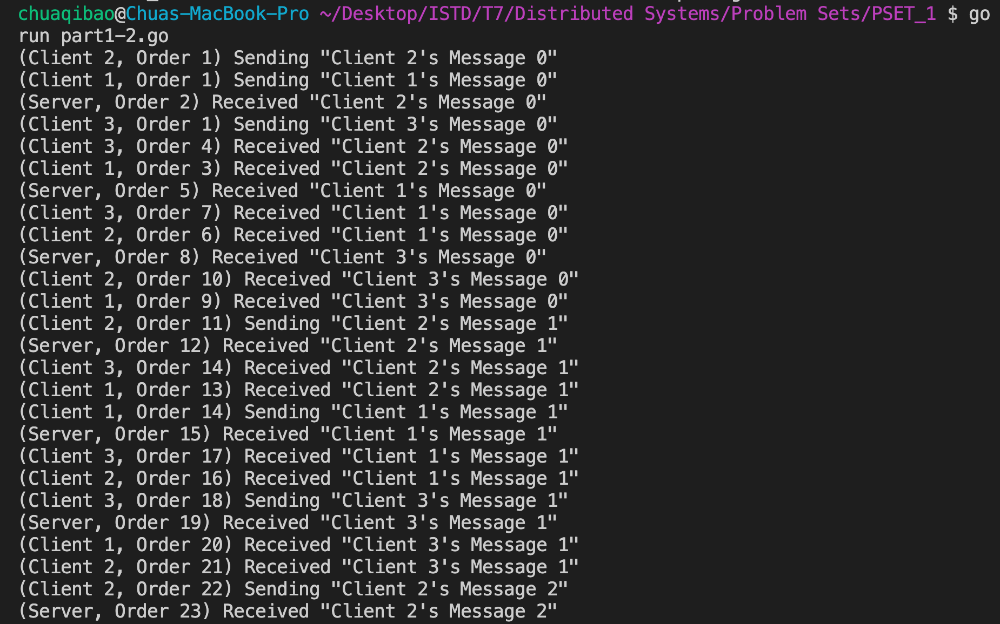
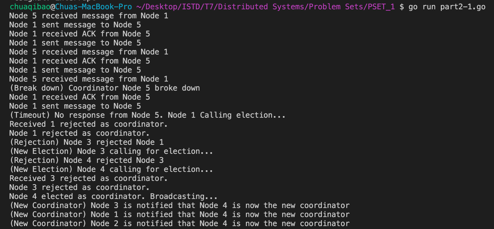
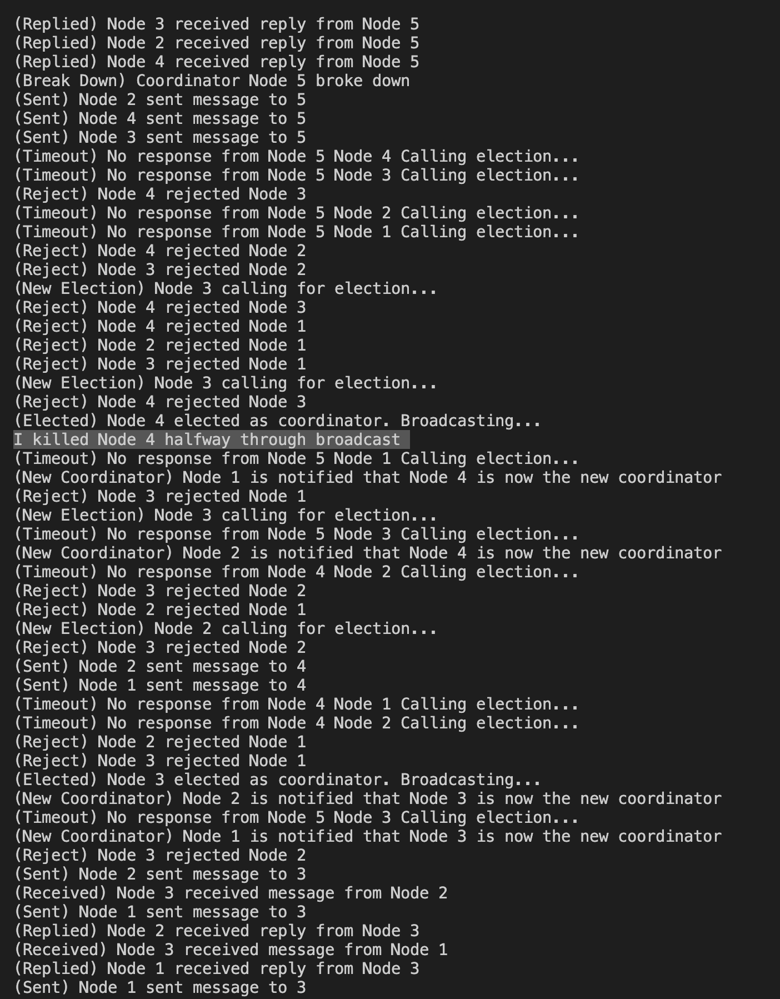
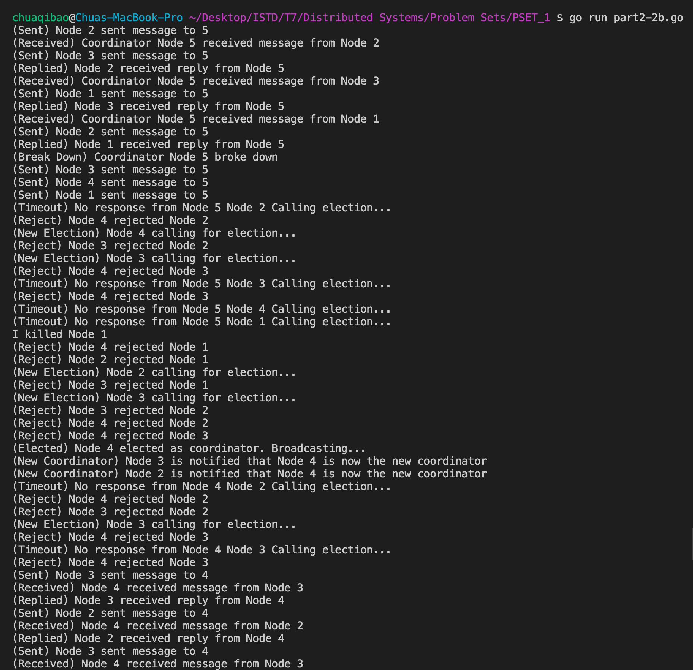
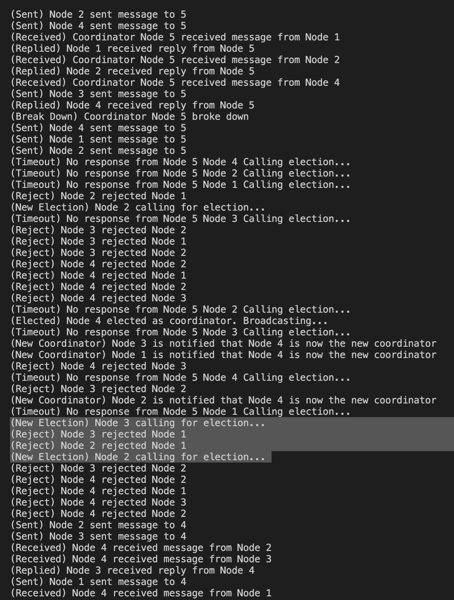
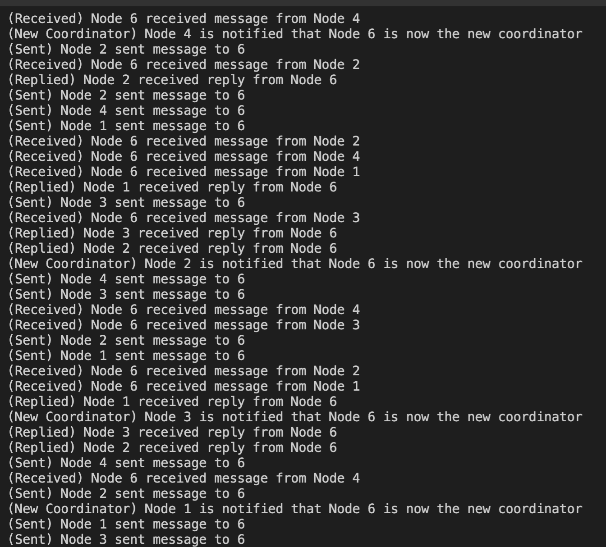

# Distributed Systems Problem Set 1
Chua Qi Bao 1004494

## How to Run
1. Uncomment all the lines in the file
2. Comment out all other files (except the 1st line)
3. Run the file in terminal as follows
```
go run <file name>
```

## Question 1

Configurations:
* 1 Server and 3 Clients
* 3 Request channels and 3 Response channels
* No special libraries were used


### Part 1.1


### Part 1.2

The order of the server/client is printed in the brackets.



### Part 1.3
Vector Clock: `[client 1, client2, client 3, server]`


#### Causality Violation
Code for detecting Potential Causality Violation is in `line 71`. 

## Question 2
Basic Configurations
* 1 Faulty coordinator node
* 4 Normal nodes
* No special libraries were used

Things to Note:
Try to make the sleep value at `line 47` in Part 2.2a, `line 48` in Part 2.2b, `line 45` in Part 2.3 and `line 68` in Part 2.4 small so that you won't see random `(Timeout)` logs after the program reaches a stable state. I made the sleep values higher so that we can read the logs. The timeouts occur because the goroutine sleeps too long and context switching doesn't switch fast enough to that goroutine. 

### Part 2.1

To test for Best/Worse Case, change the client `id` at `line 51`.
* Best Case: `id == 4` (if client 4 fails, only client 4 needs to call for election) 
* Worst Case: `id == 1` (if client 1 fails, clients 2, 3 and 4 will need to call for elections too)

The program terminates on its own once the election process is over. 



### Part 2.2a
How it works
1. Coordinator first fails when you see the `(Break Down) Coordinator Node 5 broke down` message. 
2. Clients that send message to the failed coordinator will face `(Timeout) No Response from Node 5, Node <client id> Calling election`, as they don't receive a reply.
3. Elections will occur with `(Reject)` and `(New Election)` events as clients with smaller ids are rejected and clients with higher ids trigger new elections
4. Until `(Elected) Node 4 elected as coordinator. Broadcasting...`, as Node 4 has the highest id after the failed Node 5 coordinator. `(Elected)` just means that the node assumes it's the coordinator now because it got no rejections. It doesn't mean that election is complete
5. Then `I killed Node 4 halfway through broadcast`.
6. You will see that some nodes are notified that Node 4 is the new coordinator while some don't get notified in `(New Coordinator) Node <id> is notified that Node 4 is now the new coordinator`
7. Then Step 2 and 3 will repeat.
8. Until `(Elected) Node 3 elected as coordinator. Broadcasting...`
9. Nodes 1 and 2 will be notified that Node 3 is now the new coordinator with `(New Coordinator) Node 1/2 is notified that Node 3 is now the new coordinator`.
10. And you will see the program enter stable state when all `(Sent)` messages get `(Received)` and `(Replied)` repeatedly.



### Part 2.2b

How it works:

Same as Steps 1-4 from Part 2.2a, just that `I killed  Node 1` when election started so Node 1 will not be notified that Node 4 is now the coordinator (since it failed).



### Part 2.3

How it works:
* You can see multiple elections ongoing by observing the `(New Election)` tag
* Node 4 will become the new coordinator after Node 5 fails and all nodes will be notified with `(New Coordinator) Node <id> is notified that Node 4 is now the new coordinator`.
* The program reaches a stable state when all `(Sent)` messages get `(Received)` and `(Replied)` repeatedly



### Part 2.4

How it works
1. Same as Steps 1-4 from Part 2.2a and the systems will reach a stable state for awhile where Node 4 is the coordinator.
2. Then a new node joins and notifies all other nodes with `(Notification) New node sending info to other nodes...`
3. Once all the nodes are notified of the new node's existence, it will call for an election.
4. When Node 6 wins the election, all nodes will be notified with `(New Coordinator) Node <id> is notified that Node 6 is now the new coordinator`.
5. The program reaches a stable state when all `(Sent)` messages get `(Received)` and `(Replied)` repeatedly



